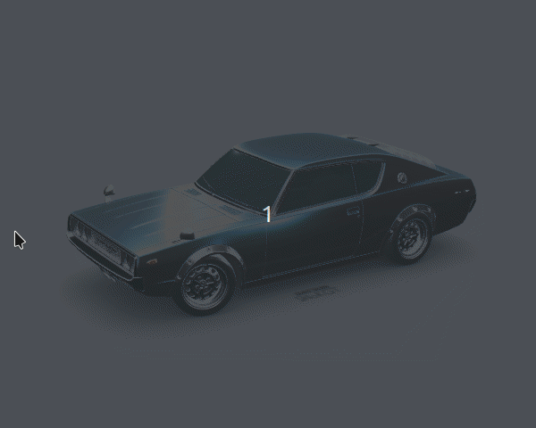

# Three.js: Learning steps

My intention with this repository is to document the learning steps that I walked by to learn how to use Three.js. Not necessarily to master it, but to get the will do cool things.

    

The latest thing 've done: Spinning cube

## Cool things done until now
- [x] A spinning cube
- [X] Load 3D car model

## Important lessons

- The scene, camera and renderer are the three essential things to be able to show anything on screen. 
- If you want to find nice and free 3D models you can look at [Sketchfab](https://sketchfab.com/)
- [GTFLLoader](https://github.com/mrdoob/three.js/blob/master/examples/js/loaders/GLTFLoader.js) is a nice library to load models of GTFL extension which recommended by Three.js because of its efficiency and relative lightweight.
- If you want to add the orbit animation to look at all angles of your scene you can use the lib [Orbit Control](https://github.com/mrdoob/three.js/blob/master/examples/js/controls/OrbitControls.js).