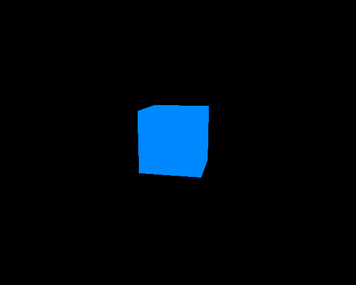

# Three.js: Learning steps

My intention with this repository is to document the learning steps that I walked by to learn how to use Three.js. Not necessarily to master it, but to get the will do cool things.

    

The latest thing 've done: Spinning cube

## Cool things done until now
- [x] A spinning cube

## Important lessons

- The scene, camera and renderer are the three essential things to be able to show anything on screen. 